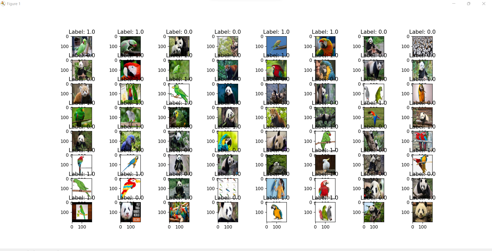
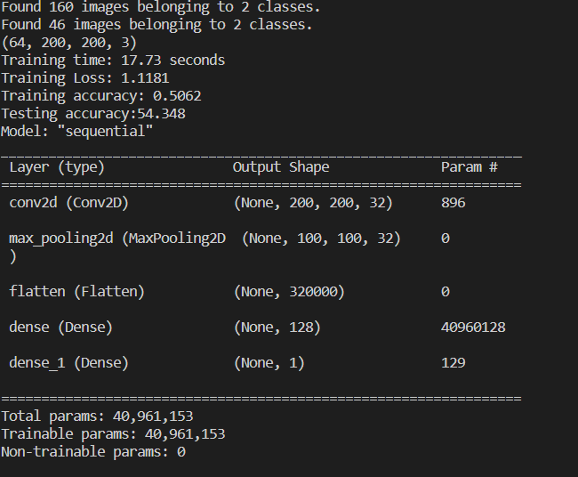
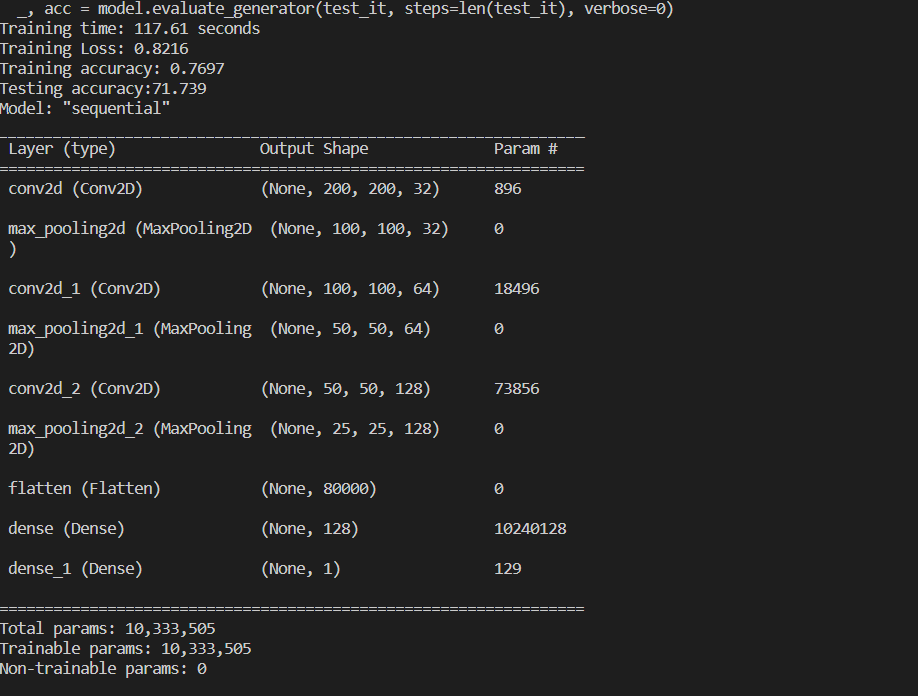
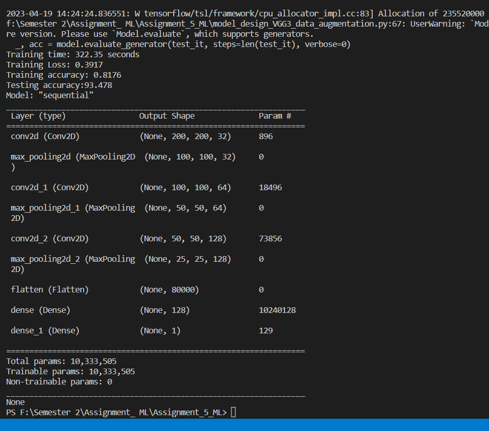
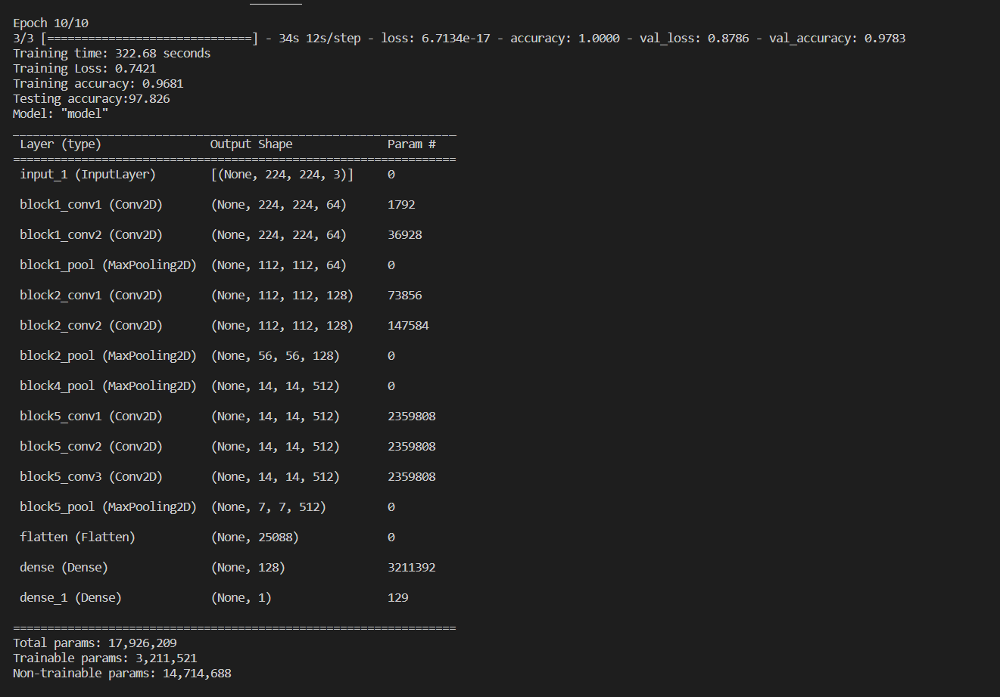
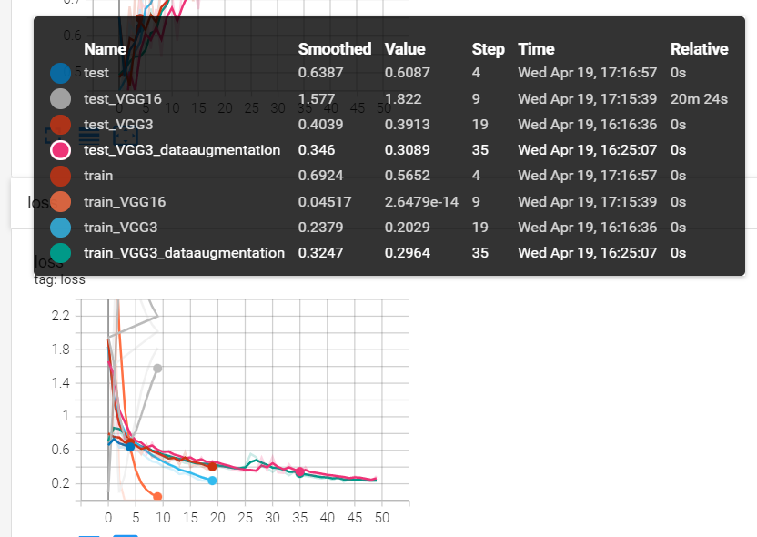
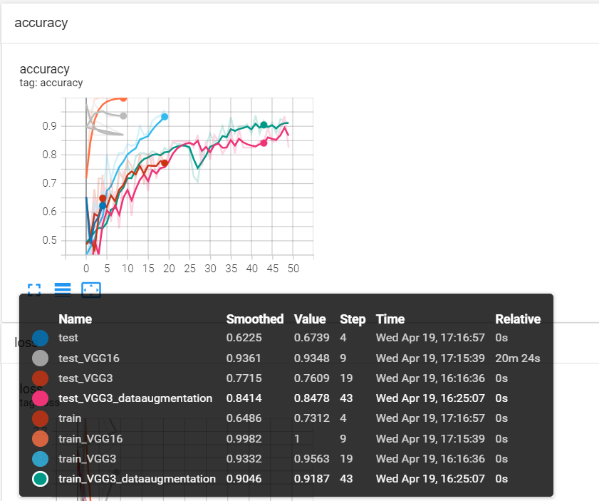
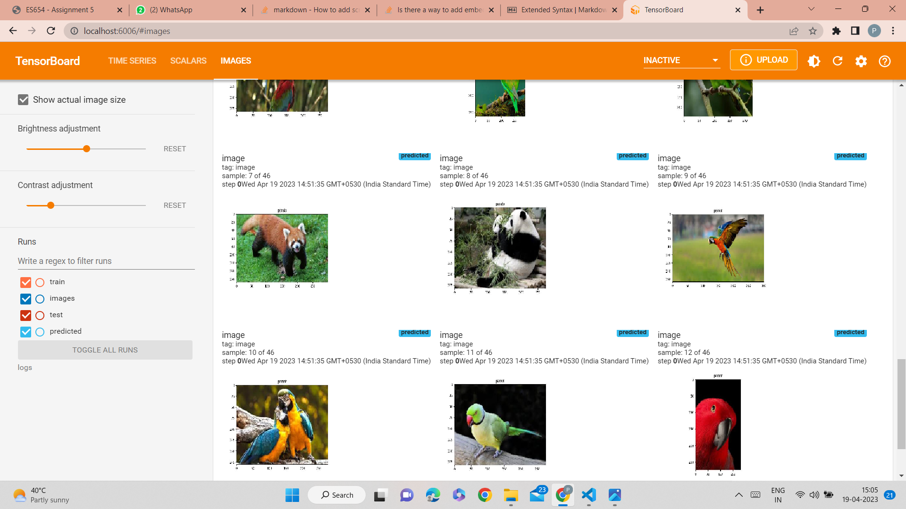
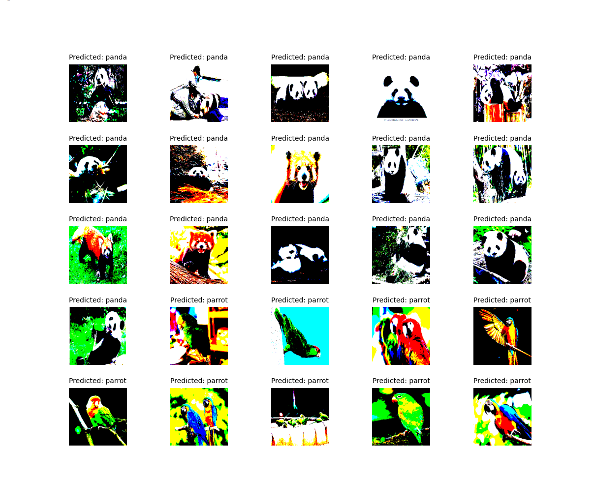
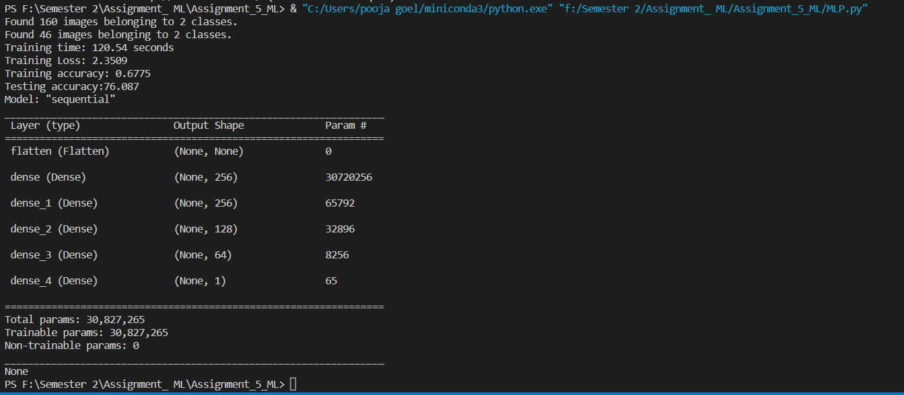

# Assignment-5
- [Assignment-5](#assignment-5)
- [Question-1](#question-1)
  - [Dataset creation](#dataset-creation)
  - [comparison the performance on a binary classification task of the following models:](#comparison-the-performance-on-a-binary-classification-task-of-the-following-models)
    - [VGG(Block-1)](#vggblock-1)
    - [VGG(Block-3)](#vggblock-3)
    - [VGG (3 blocks) with data augmentation](#vgg-3-blocks-with-data-augmentation)
    - [Transfer learning using VGG16 or VGG19](#transfer-learning-using-vgg16-or-vgg19)
  - [Use Tensorboard to log the following:](#use-tensorboard-to-log-the-following)
  - [Now you have to present various insights. For instance, you should discuss the following: \[2 marks (0.5 marks for each question)\]](#now-you-have-to-present-various-insights-for-instance-you-should-discuss-the-following-2-marks-05-marks-for-each-question)
  - [MLP model with comparable number of parameters as VGG16 and compare your performance with the other models in the table.](#mlp-model-with-comparable-number-of-parameters-as-vgg16-and-compare-your-performance-with-the-other-models-in-the-table)

# Question-1
 ## Dataset creation
the first name of the team members are: Pooja and Pinki, they can choose a dataset:
                            
                           Panda VS Parrot

we refer to [resource 1](https://python.plainenglish.io/how-to-automatically-download-bulk-images-for-your-dataset-using-python-f1efffba7a03)  and download 100 images of both classes (total 200 images). Of these 100 images of each class.

we created a data folder in system and following keras libarary is used:

     ```python
    # create data generator
    datagen = ImageDataGenerator(rescale=1.0/255.0)
	# prepare iterators
    train_it = datagen.flow_from_directory('dataset_panda_vs_parrot/train/',
		class_mode='binary', batch_size=64, target_size=(200, 200))
    plot_image(train_it)
    test_it = datagen.flow_from_directory('dataset_panda_vs_parrot/test/',
		class_mode='binary', batch_size=64, target_size=(200, 200))
        ```

 we can see screenshot of one batch=64 dataset as below screenshot:

  
 ## comparison the performance on a binary classification task of the following models:

 ### VGG(Block-1)

 his model would have relatively low capacity and may struggle to learn complex features and patterns in the data. However, it would likely train relatively quickly due to its small size, and might perform adequately on a simple binary classification task with a small dataset.

* Training time                    :18.18 seconds
* Training loss                    :0.9666
* Training accuracy                :0.4912
* Testing accuracy                 :65.217
* Number of model parameters       :40,961,153



### VGG(Block-3)

This model would have higher capacity than the 1-block VGG model, allowing it to learn more complex features and patterns in the data. However, it would also take longer to train and might be more prone to overfitting if the dataset is small. If the dataset is large enough and the model is well-tuned, it could perform quite well on a binary classification task.

* Training time                    : 
* Training loss                    :
* Training accuracy                :
* Testing accuracy                 :
* Number of model parameters       :
  
  

### VGG (3 blocks) with data augmentation

ata augmentation can help increase the effective size of the dataset and prevent overfitting by creating synthetic variations of the input images. This can lead to better performance on a binary classification task, especially when combined with a model like the 3-block VGG that has higher capacity to learn from the augmented data.

* Training time                    : 
* Training loss                    :
* Training accuracy                :
* Testing accuracy                 :
* Number of model parameters       :

 

### Transfer learning using VGG16 or VGG19

Transfer learning involves using a pre-trained model as a starting point for training on a new dataset. VGG16 and VGG19 are both popular pre-trained models that have been trained on large datasets like ImageNet. By using transfer learning, you can leverage the features learned by these models on the new dataset, potentially achieving better performance than training from scratch. This approach can be especially effective when the new dataset is small, since the pre-trained model already has a strong set of features that can be fine-tuned on the new dataset.

* Training time                    : 
* Training loss                    :
* Training accuracy                :
* Testing accuracy                 :
* Number of model parameters       :



## Use Tensorboard to log the following:

Scalars

Training loss v/s epochs and Training accuracy v/s epochs



Testing accuracy  v/s epochs and Training accuracy v/s epochs



Images

Show all images from the test set and their predictions



## Now you have to present various insights. For instance, you should discuss the following: [2 marks (0.5 marks for each question)]

1. Are the results as expected? Why or why not?

 VGG (1 block): This model would have relatively low capacity and may struggle to learn complex features and patterns in the data. However, it would likely train relatively quickly due to its small size, and might perform adequately on a simple binary classification task with a small dataset.
training accuracy:
testing accuracy: 

VGG (3 blocks): This model would have higher capacity than the 1-block VGG model, allowing it to learn more complex features and patterns in the data. However, it would also take longer to train and might be more prone to overfitting if the dataset is small. If the dataset is large enough and the model is well-tuned, it could perform quite well on a binary classification task.
training accuracy:
testing accuracy: 

VGG (3 blocks) with data augmentation: Data augmentation can help increase the effective size of the dataset and prevent overfitting by creating synthetic variations of the input images. This can lead to better performance on a binary classification task, especially when combined with a model like the 3-block VGG that has higher capacity to learn from the augmented data.
training accuracy:
testing accuracy: 

Transfer learning using VGG16 or VGG19: Transfer learning involves using a pre-trained model as a starting point for training on a new dataset. VGG16 and VGG19 are both popular pre-trained models that have been trained on large datasets like ImageNet. By using transfer learning, you can leverage the features learned by these models on the new dataset, potentially achieving better performance than training from scratch. This approach can be especially effective when the new dataset is small, since the pre-trained model already has a strong set of features that can be fine-tuned on the new dataset.
|model name |Training time | Training loss | Training accuracy | Testing accuracy | Number of model parameters |
|:----------|:------------|:----------|:---------|:--------|:--------|
|VGG 1 Block|18.18 seconds|0.9666|0.4912|65.217|40,961,153|
|VGG 3 Block|117.61 seconds|0.8216|0.7697|71.739|10,333,505|
|VGG 3 Block with augementation|322.35 seconds|0.3917|0.8176|93.478|10,333505|
|VGG 16|322.68 seconds|0.7421|0.9681|97.82600|17926209|
|MLP|120.54|2.3509|0.6775|76.087|30827265|

VGG 16 takes more time as compare to others but model have hightest accuracy and lowest loss. for testing data model gives 100 per accuracy.


   
   

2. Does data augmentation help? Why or why not?
   Yes,
Image data augmentation is a technique that can be used to artificially expand the size of a training dataset by creating modified versions of images in the dataset.

Training deep learning neural network models on more data can result in more skillful models, and the augmentation techniques can create variations of the images that can improve the ability of the fit models to generalize what they have learned to new images.

Data augmentation can also act as a regularization technique, adding noise to the training data, and encouraging the model to learn the same features, invariant to their position in the input.

Small changes to the input photos of Panda and parrot might be useful for this classification problem, such as small shifts and horizontal flips. These augmentations are specified as arguments to the ImageDataGenerator as follow:

         
ImageDataGenerator(rescale=1.0/255.0,
 width_shift_range=0.1, height_shift_range=0.1, horizontal_flip=True)

augmentations only used for the training dataset. The augmentations should not be used for the test dataset.

we can see improving accuracy with augmentation. 
   
   
3.Does it matter how many epochs you fine tune the model? Why or why not?

Yes

The term "number of epochs" refers to how many times the complete    dataset was run through the model during training while fine-tuning a pre-trained model.
The goal of fine-tuning is to update the weights of the previously trained model on a new dataset at a lower learning rate than was used during the first pre-training phase.
If the number of epochs is too small, Underfitting will occurs becuase the model is unable to understand the detailed patterns present in the data, causing it to be less accurate on validation and test data.
If the number of epochs is too large, the model may begin to overfit to the training data, which means it will memorise the training data rather than generalise to new data. This may result in greater volatility in the models predictions and worse accuracy on the validation and test data.
It is critical to choose the appropriate number of epochs for fine-tuning based on the difficulty of the job, the size of the dataset, and the model and data's unique qualities. This number is normally computed by tracking the model's performance on a validation set during training and stopping when the validation accuracy stops improving or begins to deteriorate.


4.Are there any particular images that the model is confused about? Why or why not?

NO

the accuracy of  VGG16  for the testing dataset is 100 percent.

screenshot:-



##  MLP model with comparable number of parameters as VGG16 and compare your performance with the other models in the table.
|model name |Training time | Training loss | Training accuracy | Testing accuracy | Number of model parameters |
|:----------|:------------|:----------|:---------|:--------|:--------|
|VGG 1 Block|18.18 seconds|0.9666|0.4912|65.217|40,961,153|
|VGG 3 Block|117.61 seconds|0.8216|0.7697|71.739|10,333,505|
|VGG 3 Block with augementation|322.35 seconds|0.3917|0.8176|93.478|10,333505|
|VGG 16|322.68 seconds|0.7421|0.9681|97.826|17926209|
|MLP|120.54|2.3509|0.6775|76.087|30827265|



